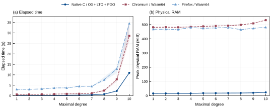
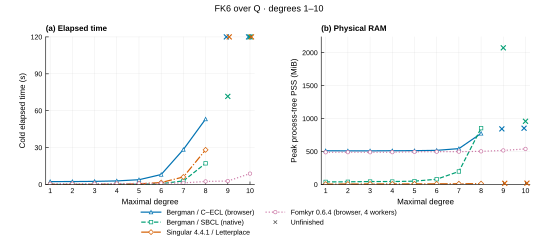

```
GEORGE(1)                      George Manual                      GEORGE(1)
```

## NAME

**george** — Gröbner bases, Hilbert series and Anick resolutions in the
browser, *an interface to bergman and more…*

## TRY IT

### [→ ckpeiika.github.io/george](https://ckpeiika.github.io/george/)

No installation. Everything runs in your browser; nothing is sent to a server.

## SYNOPSIS

```
npm ci && npm run serve        open http://127.0.0.1:8000/
npm run serve:fomkyr           local server with isolation for fomkyr
npm test                       unit tests
npm run test:ui                browser checks: examples, EN/RU, themes, /george/
npm run wasm:build:backends    rebuild all four engines
npm run sources                refresh the source archives beside the site
```

## DESCRIPTION

**George** runs **bergman-1.001-fix** in the browser: the original bergman 1.001
with documented fixes enabled by default and original behavior in legacy mode. It computes
Gröbner bases in free associative and commutative algebras over ℚ, 𝔽₂ and
𝔽ₚ, Hilbert and Poincaré–Betti series, Anick resolutions, Betti numbers of
algebras and modules, and Hochschild homology. Arithmetic is exact.

**Fomkyr 0.6.8** is the independent [fast pure C engine](fomkyr/README.md) for
homogeneous noncommutative Gröbner bases and exact Hilbert coefficients. Its
standalone executable uses pthread workers and durable checkpoints. George runs
the same C kernel through WebAssembly. Native builds use O3 and LTO, with optional
local instruction-set tuning.

## FOMKYR NATIVE AND BROWSER



In the retained Fomkyr 0.6.6 comparison, with four workers, a 4 GiB allowance and 128-pair batches, FK6 degree 10 took a
median **10.95 s** in native C with O3/LTO/PGO, **28.61 s** in Chromium and
**34.54 s** in Firefox. These are fresh ordinary exact calculations with full
text export. Degrees 8–10 have three trials; bands show the time ranges.
Native RAM uses OS peak RSS; browser RAM uses sampled process-tree PSS and
includes the browser. [Protocol and measurements](docs/benchmarks/fomkyr-0.6.6-native-browser.json).

Build the standalone engine with `make check` followed by `make` in `fomkyr/`.
The [manual](fomkyr/README.md) covers input, memory and checkpoint resume.
The FK6 browser preset selects Fomkyr with its fast default reduction settings.

## FK6 BENCHMARK



The [FK6 presentation](test/fixtures/fomin-kirillov-user.json) has 15 generators
and 100 quadratic relations over ℚ. These are historical **Fomkyr 0.6.4** measurements. Each point is one fresh run on the same
Linux host, with a 120-second cap and a 2 GiB memory allowance. Fomkyr uses
memory64 and four workers. Browser Bergman uses the faster measured C/ECL
O3 + LTO addressing mode; wasm32 won every completed comparison.

RAM includes the browser and runtime. Crosses mark unfinished runs, whose
RAM peak was observed before stopping. At degree 8, Fomkyr took **2.50 s**,
native Bergman **17.21 s**, Singular **28.17 s**, and browser Bergman **53.21 s**.
Fomkyr also completed degree 10 in **8.85 s**. These results describe this
presentation and measurement setup.

[Methods and downloads](docs/benchmarks/README.md) ·
[Measurements (CSV)](docs/benchmarks/fk6-0.6.4.csv)

## ARCHITECTURE

```
bergman 1.001 (Standard Lisp)    vendor/bergman-1.001/   unmodified
        │
        ▼
Common Lisp build                ports/common/           patches, fixes, legacy mode
        │
        ▼
ECL bytecode / ECL Lisp→C       ports/ecl/
        │
        ▼
WebAssembly (Emscripten)         web/engine/ (32-bit and memory64 backends)
        │
        ▼
Web Worker ⇄ JavaScript UI       web/engine/worker.js, web/src/
        │
        ▼
static site (GitHub Pages)       web/ → gh-pages
```

Fomkyr has a separate C pipeline:

```
fomkyr/src/ + native/ → C11 + pthreads → standalone fomkyr CLI
          │
          └→ Clang O3/LTO → Wasm32/Wasm64 → George browser UI
```

## DISCLAIMER

THIS SOFTWARE IS VIBE-CODED! The Bergman engines use bergman's mathematics; fomkyr is an independent C implementation. The interface is tested against the
original: in legacy mode all 37 stored bergman outputs match byte for byte,
and results are compared with a native SBCL build, Bergman 2 and Singular
(*docs/development/VALIDATION.md*). Check results that matter.

## USAGE

**Input**
: Relations with integer coefficients, e.g. `x^2-y^2, xy`. Single letters
  may be juxtaposed: `xyx`.

**Settings**
: Field, monomial order, weights and degree limit. Every bergman mode is
  under *More settings*. The “?” buttons explain settings without expanding
  all their help text at once.

**fomkyr**
: Select **fomkyr / C O3 + LTO** for homogeneous noncommutative Gröbner
  bases with 1–16 generators, unit generator degrees, ordinary degree/left
  lexicographic order, ℚ or a prime field. **Worker count** accepts 1–32;
  0 selects the browser’s reported CPU threads minus one, within 1–32.
  Unsupported tasks/settings are greyed out.
  Shared multicore uses browser isolation. Without it, automatic execution
  uses a genuine single-worker module; denied disk storage can fall back to RAM.
  Firefox uses a portable I/O owner while compute lanes remain parallel.
  Runtime information reports actual workers, bitness, storage and fallbacks.
  A first visit to the hosted site may reload once to enable isolation.
  Blank **Maximal degree** requests completion without a chosen degree bound;
  the run still obeys memory and time limits and can be stopped. Long words
  have variable-length storage with a configurable workspace budget.
  The kernel budget is at most 14304 MiB; larger allowances select memory64.
  Degree checkpoints can resume the same presentation across execution modes.
  Optional exact Hilbert coefficients appear in **Series**. Blank **Series
  degree** uses the computed degree; a longer prefix requires a proved complete
  basis. Integer coefficients stay exact in the page and CSV/JSON downloads.
  Runtime tuning controls have help under “?” and are saved in Share links.
  Worker count 0 uses the browser’s reported CPU threads minus one, within
  1–32; choose 1–32 explicitly to compare counts on your presentation.
  Single-worker execution uses one lane.
  New fomkyr runs enable monomial pruning, disk storage, checkpoint resume
  and sparse heap reduction, exact rational reduction and compiled local rewrites.
  Rewrite and shared reducer caches have bounded automatic allowances;
  their tuning controls are in **Engine**. Exact Hilbert counting is off until selected;
  workers and workspace are automatic, and new batches use 128 pairs. Saved settings and Share
  links retain their explicit choices.
  Output has primitive coefficients; earlier polynomial tails are not globally
  interreduced. Large results have a preview and full disk downloads. Old
  Native NC form preferences and Share links migrate to fomkyr.

**Relation preview**
: The parsed list below the input starts expanded and can be folded.
  Relations share compact rows, grouped by their number of terms: monomials,
  binomials, then longer expressions. Each number refers to its input position.
  Basis results use the same compact grouping within each degree.
  Copying selected expressions preserves powers such as `a^2` in plain text.

**Memory**
: The default engine is **C / ECL O3 + LTO (memory64)** with a **15.7 GiB**
  heap allowance; memory grows on demand. Browsers without memory64 support
  start with the 32-bit C engine and 2 GiB. Saved settings and older Share
  links preserve their selected engine and allowance. The 32-bit engines allow
  up to 4095 MiB, with a 4 GiB total Wasm ceiling. Select **C / ECL O3 + LTO
  (memory64)** for allowances up to 16 GiB or **No heap cap**. This removes
  George's heap cap; the browser still limits this build to 16 GiB and can
  exhaust available memory earlier. A browser with memory64 support is required.
  Memory grows as needed. **Monomial pruning** can reduce retained memory for
  unweighted homogeneous noncommutative Gröbner bases.
  An exhausted heap returns saved basis output as partial and releases the
  worker. A larger limit does not guarantee completion of an unbounded basis.
  Beside “Computing…”, compact icons show allocated Wasm memory, elapsed
  seconds, and the current degree when reported by the engine. Hover, focus
  or tap an icon for details. fomkyr reports each degree; a checkmark marks
  a completed degree and an ellipsis marks a degree still being processed.
  The degree tooltip shows the last completed degree, pair/reduction counts,
  and whether the engine is saving a checkpoint, counting Hilbert coefficients
  or exporting results. A dash means the engine has not reported its degree.
  The memory icon reports Wasm linear memory capacity, including reserved
  workspace. Physical RAM is committed as pages are touched. Automatic fomkyr
  memory uses 4/7 of the effective allowance for reduction workspace and,
  over ℚ, up to 1/7 for exceptional rows. **Engine** shows these amounts;
  the live tooltip reports the current run's workspace. Browser objects and
  disk checkpoints have separate sizes.

**Output**
: The basis by degree, series, Betti tables, Anick differentials, the raw
  files and the bergman session. **Files** can download the text results as
  a ZIP, including the full saved basis when the displayed output is a preview.

**Share**
: The small *Share* button copies a compact link containing the presentation
  and all form settings, including the memory limit, language and theme.
  Opening the link restores them; press Compute to run the calculation.
  Computation times are displayed in seconds, with up to two decimal places.

**Legacy mode**
: `(SETLEGACYMODE T)` or the checkbox retains original bergman 1.001 behavior. The
  default mode applies documented fixes: the Poincaré–Betti file,
  nonhomogeneous reduction, critical-pair and inclusion handling, the
  itemwise degree limit, mode-sensitive monomial comparison and safe-mode
  Anick tensor ordering. `(SETLEGACYMODE NIL)` restores fixed mode.

**Anick**
: Augmentation *graded* (x ↦ 0) or *monoid* (x ↦ 1). Ungraded Betti numbers
  are in `homology.json`, chains in `resolution.jsonl`
  (*docs/RESOLUTION-EXPORT.md*).

**Guide**
: The *User guide* tab, with eight guided examples. English/Russian,
  light/dark.

## COMMANDS

| Command | Checks |
|---|---|
| `npm test` | parsing, validation, exact ranks, worker lifecycle |
| `npm run wasm:test` | the 37 historical outputs, both modes |
| `npm run test:examples` | the 14 presets through the real engine |
| `npm run sbcl:build`, `sbcl:test`, `sbcl:test:legacy` | native SBCL reference |
| `npm run test:extra` | remaining original sessions |
| `npm run test:ocaml` | Bergman 2 aliases and references |
| `npm run test:algebra` | Singular, critical pairs, Hilbert dimensions |
| `npm run test:backends` | seeded Latin hypercube inputs/settings, exact parity across the four engines |
| `npm run test:native` | imported kernel tests, bounded FK parity against Bergman and Singular |
| `npm run test:native:browser` | alias for `test:fomkyr:browser` |
| `npm run test:fomkyr` | imported suites, 64 FK LHS samples, four anchors and 27 physics cases, all four fomkyr variants, C/ECL and bounded Singular |
| `npm run test:fomkyr:browser` | Firefox/Chromium, root/project paths, isolated/unshared execution, OPFS, resume, Share, long words and cancellation |
| `npm run fomkyr:build:native` | standalone C executable, portable O3/LTO |
| `npm run test:fomkyr:cli` | pthread CLI, partial checkpoints, native/Wasm resume and independent Hilbert authority checks |
| `npm run test:fomkyr:upgrade` | existing fomkyr 0.3 browser checkpoints resumed by the current engine; independent exact certificates |
| `npm run test:fk` | small Fomin–Kirillov LHS cases, all four engines, native SBCL and Singular; degrees 2–4 |
| `npm run test:fk6` | FK6 and a fixed-seed invertible generator scaling, degrees 1–8; all four fomkyr variants and bounded C/ECL/Singular comparisons |
| `npm run test:fk6:finite` | an independent random-coefficient FK6-shaped presentation, stopping at the proved finite bound, degree 6 |
| `npm run test:upstream` | 90 adapted Singular/Plural, SymPy and GBNP field cases; independent oracles |
| `npm run test:resolution:names` | long generator names, differentials |
| `npm run test:braid` | native/Wasm braid resolutions, full differentials, projectivity and weighted bounds |
| `npm run test:reader` | same-session recovery after missing files, EOF, stream redirection and syntax errors |
| `npm run test:browser`, `test:browser:regression` | Chromium suites |
| `GEORGE_LARGE_MEMORY=1 npm run test:browser` | Chromium allocation above 3 GiB, heap exhaustion, saved output and restart |
| `npm run test:ui` | guide, EN/RU, themes, MathJax, `/george/` path |

## VERSION

George **0.6.8** includes fomkyr **0.6.8**, configurable multicore execution,
disk checkpoints and full result downloads. Unsupported tasks and settings
are disabled for this backend. Live allocated Wasm memory appears beside
the computation status, alongside degree progress and elapsed seconds.
Mathematical options appear in **More settings**; runtime controls are in the separate
**Engine** submenu. Settings have expanded EN/RU help under “?”. New fomkyr
jobs enable its reduction optimizations and pruning, with optional Hilbert
counting off. The default is Bergman memory64 with a 15.7 GiB allowance.
Parsed relations can be folded, and relations and basis results share compact
rows grouped by term count. Mathematical copying preserves plain-text powers. Basis totals and degree counts
come from engine metadata; previews can be expanded from the saved full result.
The elapsed counter stays in seconds. Engine settings include the radix word queue
and shared overflow workspace, with automatic defaults and help for each control.
New fomkyr jobs use batches of 128 pairs. Automatic memory reserves 4/7 of
the effective allowance for scratch and up to 1/7 for exceptional rational rows;
manual mode accepts explicit workspace sizes. Workspace capacities appear
under **Engine**, and live memory help uses the actual run's values.

Fomkyr 0.6.8 preserves unfinished exact reductions across cooperative slices
and commits ready rows after reduction against the updated basis. Checkpoints
can advance while a long row remains pending. The engine menu includes the
legacy barrier scheduler, slice duration, pending work window and radix cache.
Native progress reporting remains active while waiting for workers. Version 0.6.8
adds an optional FK6 dimension profile under mathematical settings. Assisted
results are explicitly conditional on the imported dimensions; its external
proof package is not replayed here. The option is off by default.

George 0.5 added the **C / ECL O3 + LTO (memory64)** engine, allowances up to
16 GiB and a **No heap cap** setting. It also adds optional monomial pruning
and raises the largest 32-bit heap allowance to 4095 MiB. The 32-bit C backend
is available as the fallback; memory64 now defaults to 15.7 GiB. Wider pointers
can increase memory use.

George 0.4 adds a computation engine selector in **More settings**. It keeps
the same Bergman algorithms, with Lisp / ECL O2, Lisp / ECL O3 + LTO and
**C / ECL O3 + LTO** selected by default. ECL compiles existing Lisp functions
to C; some auxiliary functions still use bytecode. The selected engine is saved and shared with the
presentation. Backend parity is checked on reproducible Latin hypercube
samples of inputs and settings.

George 0.3 added compact share links, computation times in seconds and the
selectable memory allowance up to 3.5 GiB. It includes the persistent Lisp
console introduced in 0.2: command completion, history,
original Bergman help, and session files. Missing files or unavailable keyboard
input now report errors in the engine without restarting the session. The
reader and streams recover after errors; variables and files remain available.

## FILES

| Path | Contents |
|---|---|
| `vendor/bergman-1.001/` | original sources and regression fixtures |
| `ports/common/` | dated patches, overlay, legacy mode |
| `ports/ecl/`, `ports/sbcl/` | Wasm engine build; native reference |
| `web/` | the site, the engine, local MathJax |
| `test/`, `tools/` | tests, checkers, build tools |
| `docs/` | user guide, resolution export format |
| `docs/development/` | validation, source review, handoff |
| `build/` | ignored: toolchains, builds, logs |

## ENVIRONMENT

Node.js 22.8 or later. Engine build: Git, Python 3, a C toolchain and make;
the toolchain goes to `build/toolchain/` (`GEORGE_TOOLCHAIN`, `JOBS`).
ECL, GMP and GC are compiled at `-O2`; `GEORGE_ECL_OPT=O0` selects the
previous library settings in a separate cache. The final link uses `-O2`
and retains the GC pointer spilling pass. See the
[performance assessment](docs/development/PERFORMANCE.md) for measurements
and isolated build/profiling commands.
Reference build: SBCL. Oracle tests: Singular 4.4.1, SymPy 1.14.0,
OCaml 5.3 and dune 3.17.2
(`python3 tools/setup-oracles.py` fetches pinned copies). `CHROMIUM` selects
the browser.

Imported fixture sources: `python3 tools/setup-upstream-tests.py`.
See [upstream test reproduction](docs/development/UPSTREAM-TESTS.md).

## BUGS

A degree limit does not prove a basis complete, and some presentations have
infinite bases (use *Stop*). bergman's raw internal-degree Betti table is not
valid for nonhomogeneous relations. PSL-era outputs differ in sign
conventions. Only Chromium is verified.

## SEE ALSO

[Bergman 2](https://smimram.github.io/ocaml-alg/bergman/),
[Singular](https://www.singular.uni-kl.de/),
[ECL](https://ecl.common-lisp.dev/),
*docs/USER-GUIDE.md*, *docs/development/*

## AUTHORS

**bergman**: Jörgen Backelin (principal author), Svetlana Cojocaru,
Alexander Podoplelov, Victor Ufnarovski and others. The name honours
George Bergman and his diamond lemma.

**Bergman 2 / [ocaml-alg](https://github.com/smimram/ocaml-alg)**:
Samuel Mimram. It is the OCaml reference, and George's example families
follow it.

**Singular**: W. Decker, G.-M. Greuel, G. Pfister, H. Schönemann, with the
Letterplace and Plural extensions. It is the independent checker.

**ECL**: D. Kochmański, M. Gerbershagen, J. J. García-Ripoll and
contributors, with GMP and the Boehm–Demers–Weiser GC.

**Emscripten**, **MathJax**, **SBCL**.

**George**: the George contributors.

## LICENSE

George's code: the Bergman General Public License or GPL-2.0-or-later.
bergman, ECL, GMP, the GC, Emscripten and MathJax keep their own licenses.
See *LICENSE.md*.

```
George 0.4.0                     2026-10-01                       GEORGE(1)
```
