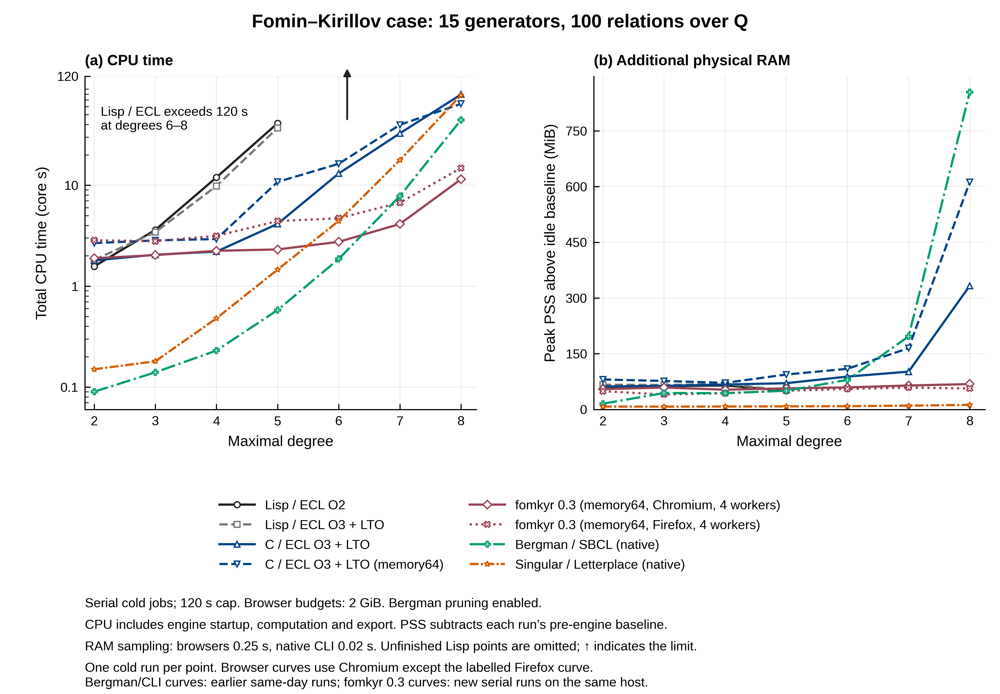
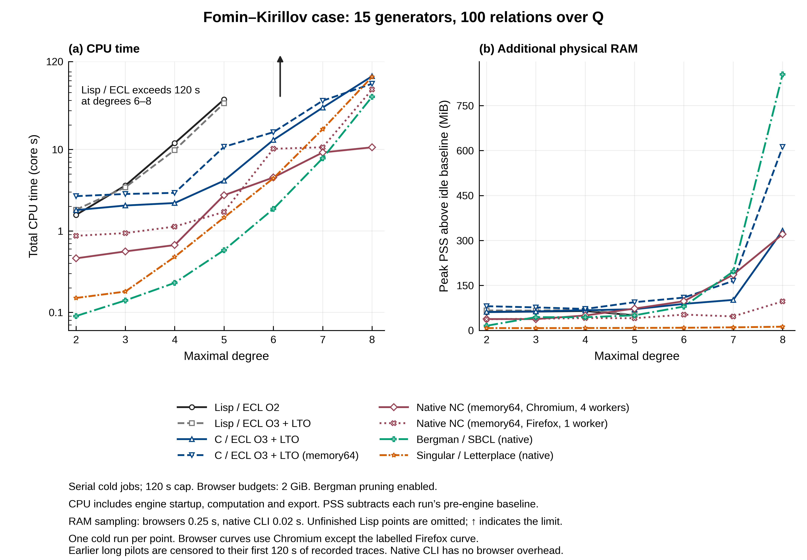

# Runtime performance assessment

## fomkyr 0.4.0 versus 0.3.0 — 2026-10-02

The same submitted 15-generator, 100-relation presentation over Q was timed
before and after the import. Each version uses fresh serial browser profiles,
memory64, 2048 MiB, four actual workers, pruning on, resume off and Hilbert
off. New 0.4 optimizations use their defaults. All correctness and oracle
work finished before the new timing series; no concurrent build or test
suite ran during either measured series. The host is the same i5-1135G7,
eight logical CPUs and 15.3 GiB RAM, with Chromium 153 / Firefox 155.

Three cold trials per version/browser/degree give:

| Browser | Degree | 0.3 median seconds (range) | 0.4 median seconds (range) | Old/new median ratio |
|---|---:|---:|---:|---:|
| Chromium | 8 | 4.24 (3.75–5.17) | 3.30 (2.54–4.16) | 1.29× |
| Firefox | 8 | 7.58 (7.14–9.24) | 6.55 (6.40–6.69) | 1.16× |
| Chromium | 9 | 19.40 (18.95–20.06) | 10.41 (9.79–10.59) | 1.86× |
| Firefox | 9 | 22.96 (21.90–28.76) | 14.86 (14.58–17.26) | 1.55× |

Degree-9 median process-tree CPU also falls: Chromium **60.29 → 35.40 core
seconds**, Firefox **65.20 → 38.94**. Additional peak physical PSS rises
slightly: Chromium **66.7 → 78.4 MiB**, Firefox **48.7 → 62.3 MiB**. The new
indexes therefore establish a speed improvement here, without a measured
memory saving. PSS subtracts each browser's own idle baseline; allocated Wasm
capacity is separate and includes reserved scratch memory.

One upgraded degree-10 trial per browser completed: **80.25 s in Chromium**
and **85.85 s in Firefox**, both with **2155 rules**. The previous version
hit the 120-second cap (two Chromium trials, one Firefox trial), so there is
no measured baseline completion time or exact degree-10 speed ratio. These
cold results also differ from the earlier progress-boundary measurements;
the cause of that variation is not established.

All **26 completed timed outputs** pass exact input membership and matching
leading-word checks. At degrees 8/9 they also pass mutual ideal reductions
against the old version. Degree 8 is the same monic polynomial set; degree 9
has one changed tail, which reduces to zero in both directions. At degree 10,
the two upgraded browsers return the same monic polynomial set; no completed
old degree-10 output is available in this series. This is consistency
evidence, not a fresh high-degree critical-pair certificate. The independent
small-degree C/ECL/Singular certificates are documented in VALIDATION.md.

[Comparison and exact audit](validation/fomkyr-04-speed-comparison/report.json),
[0.3 baseline](validation/fomkyr-04-speed-baseline/report.json),
[0.4 degree-8/9 trials](validation/fomkyr-04-speed-current/report.json) and
[0.4 degree-10 trials](validation/fomkyr-04-speed-degree10/report.json) retain
runtime hashes, all completed bases and sampled CPU/RAM traces. No browser
profiles are included in the archive.

The baseline and upgraded trials ran in groups, rather than an interleaved
randomized version comparison. Background desktop load varied (recorded
one-minute load ranges 3.55–10.24 and 3.17–8.85), and browser/filesystem caches
can affect timings. These are local three-trial medians, not a confidence
interval or a guarantee on another machine. No degree-11/12 completion or
projection is inferred.

Cold wall time includes engine startup, calculation, export and initial
result delivery, excluding browser launch/rendering. Above the preview limit,
the harness fetches the full OPFS basis for audit after the wall timer stops;
CPU/PSS sampling includes that read. Browser CPU/PSS is sampled every 0.25 s,
so brief peaks or exiting processes can be missed. Every computation has a
120-second cold wall cap. Once a version/browser times out, later trials of
the same or higher degree are skipped. An interrupted baseline pilot produced
no result row and is excluded; earlier recorded completed/capped rows remain.

The earlier 0.3 degree-2–8 plot below is retained with its original version,
conditions and asset hashes. Earlier Bergman/SBCL/Singular timings have not
been rerun for this upgrade.

For the current runtime, repeat the serial measurements and audit with:

```sh
node tools/benchmark-backend-resources.mjs --out build/validation/fomkyr-04-speed-current --configs fomkyr,fomkyr-firefox --degrees 8,9 --trials 3 --timeout-seconds 120 --memory-mib 2048 --skip-censored
node tools/benchmark-backend-resources.mjs --out build/validation/fomkyr-04-speed-degree10 --configs fomkyr,fomkyr-firefox --degrees 10 --trials 1 --timeout-seconds 120 --memory-mib 2048 --skip-censored
node tools/compare-fomkyr-resources.mjs build/validation/fomkyr-04-speed-comparison build/validation/fomkyr-04-speed-baseline build/validation/fomkyr-04-speed-current build/validation/fomkyr-04-speed-degree10
```

The baseline was captured before replacing the production 0.3 assets. Its
report records those original hashes and remains a separate input to the
audit; rerunning the current runtime does not recreate a 0.3 baseline.

## fomkyr 0.3.0 resource comparison — 2026-10-02

Fresh serial browser runs recompute the submitted 15-generator, 100-relation
Q presentation through degrees 2–8 with **fomkyr 0.3.0**. Each uses memory64,
a 2048 MiB allowance, four actual compute workers, pruning enabled,
checkpoint resume disabled and optional Hilbert output disabled. Firefox
uses `broker-exclusive` file access; Chromium uses `direct-unsafe`.
These measurements started after the validation suites finished. An earlier
timing pilot is excluded. All four prebuilt modules are imported unchanged.



[PDF](validation/backend-resources-fomkyr-degree8/backend-resources.pdf),
[SVG](validation/backend-resources-fomkyr-degree8/backend-resources.svg),
[plotted CSV](validation/backend-resources-fomkyr-degree8/backend-resources-capped.csv),
[raw CSV](validation/backend-resources-fomkyr-degree8/backend-resources.csv), and
[report with separate runtime hashes](validation/backend-resources-fomkyr-degree8/report.json)
are retained. Bergman/SBCL/Singular curves use the earlier same-day serial
comparison below on the same host. They were not rerun with this integration.
The final-size vector PDF and a grayscale rendering were inspected for
legibility, curve distinction and clipping.
Original Native NC 0.1 curves remain in the historical figure below, and
are not relabelled as new-core measurements.

| Engine | Degree 7 cold seconds | Degree 8 cold seconds | Degree 8 CPU, core seconds | Degree 8 additional peak PSS, MiB |
|---|---:|---:|---:|---:|
| fomkyr 0.3, memory64, Chromium, 4 workers | 1.35 | 3.46 | 11.48 | 68.4 |
| fomkyr 0.3, memory64, Firefox, 4 workers | 4.45 | 6.81 | 14.81 | 56.4 |
| C/ECL O3 + LTO, wasm32, earlier run | 28.23 | 73.25 | 79.30 | 333.2 |
| C/ECL O3 + LTO, memory64, earlier run | 33.54 | 61.90 | 64.14 | 612.3 |
| Bergman/SBCL, native, earlier run | 7.86 | 44.48 | 44.39 | 854.6 |
| Singular/Letterplace, native, earlier run | 17.86 | 78.12 | 78.04 | 12.4 |

At degree 8 the Chromium fomkyr run takes about **17.9× less cold wall time**
than the fastest earlier browser Bergman run; at degree 7 the ratio is
about **20.9×**. Firefox now retains multicore computation and takes 6.81 s
at degree 8, versus 46.55 s for the previous single-worker Native adapter.
The core and host both changed, so this does not isolate the worker-count
effect. These are one-run local comparisons, not paired repeated estimates.
Runtime/filesystem caches and background host load can affect timings.

All 14 new fomkyr outputs have matching exact leading-word sets with C/ECL;
degree 8 returns **990 rules**. The combined
[consistency audit](validation/backend-resources-fomkyr-degree8/leading-word-audit.json)
checks all 52 completed outputs. This is not a new full degree-8 critical-pair
certificate; extensive bounded checks are described in
[VALIDATION.md](VALIDATION.md#fomkyr-030-integration--2026-10-02).

The CPU panel ends at **120 core seconds**, and every new job has a
**120-second cold wall deadline**. Unfinished Lisp points are omitted in both
panels; an upward annotation on the left indicates that they exceed the
range. Their raw measurements and censored trace values remain in the CSVs.
Physical RAM means peak process-tree PSS minus idle baseline, sampled every
0.25 s in browsers and 0.02 s for native CLI. Reserved Wasm capacity is a
different measurement. Limit scopes and other conditions are described below.

```sh
node tools/benchmark-backend-resources.mjs --out build/validation/fomkyr-resources-degree8 --configs fomkyr,fomkyr-firefox --degrees 2,3,4,5,6,7,8 --timeout-seconds 120 --memory-mib 2048
```

The archived combined report and traces regenerate the figure directly with
`python3 tools/plot-backend-resources.py docs/development/validation/backend-resources-fomkyr-degree8/report.json`.

## CPU and physical RAM through degree 8 — 2026-10-02

The exact submitted 15-generator, 100-relation presentation over Q was
computed at degrees 2–8 with all five browser engines, Native NC in Firefox,
native Bergman/SBCL, and native Singular/Letterplace. The comparison uses
**one serial cold run per configuration and degree**, with a fresh browser
profile and engine, no checkpoint resume, and no debugger or profiler.
The host is an Intel Core i5-1135G7 with eight logical CPUs and 15.3 GiB RAM;
the browsers are Chromium 153 and Firefox 155.



[Vector PDF](validation/backend-resources-degree8/backend-resources.pdf),
[SVG](validation/backend-resources-degree8/backend-resources.svg),
[plotted data](validation/backend-resources-degree8/backend-resources-capped.csv),
[raw data](validation/backend-resources-degree8/backend-resources.csv), and
[full report](validation/backend-resources-degree8/report.json) are retained
with output files and sampled traces.

The CPU panel reports **total user and system CPU in core seconds**, with
a logarithmic scale ending at **120 core seconds**. It includes engine
startup, calculation and export; browser launch and initial page rendering
are excluded. Four busy cores can accumulate four core seconds in one wall
second. Native CLI CPU totals come from GNU time; browser totals are sampled
from the Linux process tree. The RAM panel reports **peak physical PSS above
each run's pre-engine idle baseline**, rather than allocated Wasm capacity.
PSS accounts proportionally for shared pages. Full PSS, RSS and the idle
baseline are also retained in the raw data. Browser RAM is sampled every
0.25 seconds and native CLI RAM every 0.02 seconds, so brief peaks can be missed.

Each remaining cold job was capped at **120 wall seconds**, including engine
startup. Two degree-6 interpreted pilots had already run longer when the cap
was requested. Their raw traces are preserved; the censored CSV uses only
their first 120 seconds. Unfinished Lisp points are omitted from the figure,
with an upward annotation indicating costs exceeding the range. No higher-degree cost
is extrapolated. Total CPU can exceed the wall cap with multiple threads;
the raw CSV keeps those values.

All browser engines use a 2048 MiB allowance. Bergman monomial pruning is
enabled; Native prunes automatically and selects memory64 with four
requested workers. Firefox actually uses **one worker** because its file
access requires the exclusive-access fallback. SBCL uses a 2048 MiB dynamic
space, while Singular has a 2 GiB virtual-address limit. These limits cover
different allocations and are not equivalent caps on physical RAM.
Singular uses `twostd`, `redSB`, `intStrategy`, and the same degree-left-lex
order, represented by `Dp` with reversed generator order as described in the
[Singular Letterplace documentation](https://github.com/Singular/Singular/blob/spielwiese/doc/letterplace.doc).

| Engine | Degree 7 cold seconds | Degree 8 cold seconds | Degree 8 additional peak PSS, MiB |
|---|---:|---:|---:|
| Lisp / ECL O2 | Timeout at 120 | Timeout at 120 | 60.8 at timeout |
| Lisp / ECL O3 + LTO | Timeout at 120 | Timeout at 120 | 65.7 at timeout |
| C / ECL O3 + LTO, wasm32 | 28.23 | 73.25 | 333.2 |
| C / ECL O3 + LTO, memory64 | 33.54 | 61.90 | 612.3 |
| Native NC, memory64, Chromium, 4 workers | 3.52 | 5.31 | 320.9 |
| Native NC, memory64, Firefox, 1 worker | 9.50 | 46.55 | 96.9 |
| Bergman / SBCL, native | 7.86 | 44.48 | 854.6 |
| Singular / Letterplace, native | 17.86 | 78.12 | 12.4 |

Every completed degree-8 run returns **990 elements**. A separate
[consistency audit](validation/backend-resources-degree8/leading-word-audit.json)
compares exact leading-word sets with C/ECL for all **52 completed runs**;
all agree. This check does not certify every critical ambiguity or equality
of the ideals. The previous degree-7 certificate below remains separate.

Native is fastest in this local series; Singular uses much less physical RAM
at degree 8. Firefox's time differs substantially from Chromium's, with
both the worker count and browser/storage implementation changing. The
comparison cannot attribute the difference to workers alone. A reported
25-second degree-7 Firefox run is plausible on another system, although
this run took 9.50 seconds. Native reserves about 520.5 MiB of linear memory
here, including its scratch pool; that value is not live-object memory or
physical RAM. Host load, cached runtime files, storage and sparse RAM
sampling limit the precision of this single-run comparison.

Reproduce from the repository root after preparing the existing native
oracle binaries:

```sh
node tools/benchmark-backend-resources.mjs --out build/validation/backend-resources-degree8 --degrees 2,3,4,5,6,7,8 --timeout-seconds 120 --memory-mib 2048
node tools/benchmark-native-resources.mjs --out build/validation/backend-resources-degree8 --timeout-seconds 120
node tools/audit-backend-resources.mjs build/validation/backend-resources-degree8/report.json
python3 tools/plot-backend-resources.py build/validation/backend-resources-degree8/report.json
```

The archived traces also regenerate the figure directly without computing
new bases. The figure was checked as a final-size PDF and in grayscale.
These measurements precede the fomkyr 0.3.0 integration reported above.

## Native NC versus current C/ECL — 2026-10-02

The reference 15-generator, 100-relation Q presentation was computed
through **degree 7**, with **695 rules**. Three serial trials per configuration
used fresh workers in isolated Chromium, with no debugger or concurrent
builds/oracle runs. Cold wall time includes startup, calculation and result
transfer for both engines. The 512 MiB budget is the same in every trial.
The Native memory64 row explicitly selects 64-bit execution at that budget.

| Engine/settings | Median cold seconds | Cold range, seconds | Relative to fastest Bergman |
|---|---:|---:|---:|
| C/ECL O3 + LTO, wasm32 | 30.13 | 29.32–34.81 | 0.97× |
| **C/ECL O3 + LTO, wasm32, pruning** | **29.15** | **27.82–29.42** | **1.00×** |
| C/ECL O3 + LTO, memory64 | 37.09 | 34.51–38.73 | 0.79× |
| C/ECL O3 + LTO, memory64, pruning | 34.81 | 32.21–37.66 | 0.84× |
| Native NC, wasm32, 1 worker | 5.00 | 4.51–5.32 | 5.83× |
| **Native NC, wasm32, 4 workers** | **2.91** | **2.86–3.27** | **10.02×** |
| Native NC, memory64, 4 workers | 3.25 | 2.90–5.53 | 8.97× |

Four Native workers are about **1.72×** faster than one here. This is a local
three-trial result for this bounded presentation. It does not estimate
performance at degrees 9–11 or across the full Bergman task set. Native
produces primitive coefficients and does not globally interreduce earlier
tails; its scope and output notices remain explicit.

Every timed output passes mutual reductions against the current Bergman
basis. All **695 leading words** match in all 21 runs. An independent exact
checker certifies **10250 critical ambiguities through degree 7** for a Native
result. These checks ran after the timing phase. The low-degree suite checks
Native separately against Singular; no new high-degree Singular run was made.

Allocated Wasm memory is **177.625 MiB** for Native at this budget, compared
with **92.375 MiB** for the fastest pruned Bergman configuration. Native
preallocates a shared scratch pool from the budget; this comparison establishes
a speed gain, with higher allocated linear memory in the tested settings.
Neither value measures browser RSS. The smaller scratch configurations in
the imported Node tests are separate evidence, not this browser timing series.

All trial times, source/module hashes and output filenames are in
[native-speed.json](validation/native-speed.json); the corresponding
[leading-word audit](validation/native-leading-words.json) retains each output
hash. Fresh jobs disable checkpoint resume for these measurements.

## Local default and memory reporting update — 2026-10-02

Fresh forms select memory64 and a 16077 MiB
(15.7 GiB) heap allowance. This is a preference change, not a measured
speed improvement; the timing limitations below still apply. Unsupported
browsers fall back to C wasm32/2048 MiB, and memory grows on demand.

The live indicator reports allocated Wasm linear memory during computation.
Two 120 MiB retained-array checks show memory events arriving during the
synchronous allocation command: memory64 grows from 64 to 182.75 and
327 MiB; wasm32 from 64 to 143.5625 and 316.3125 MiB. GC roots and exact
arithmetic still pass. These are allocation checks, not comparative timings
or estimates of browser RSS/live Lisp heap.

## George 0.5 memory measurements — 2026-10-02

At the original 0.5 release, memory64 had not yet been compared in a
controlled timing series. That release selected the wasm32 C backend by
default; the later default update is described above. The controlled Native
comparison at the start of this document supersedes that timing limitation.

For the reference presentation through degree 7, repeated wasm32 C runs
with pruning off/on/on/off retain the same native **695-element** result.
Allocated Wasm memory falls from **110.875 to 92.375 MiB**, about **16.7%**.
The corresponding memory64/pruning/no-cap run uses **191.1875 MiB** and
matches the same exact result. This is not a paired estimate of general
64-bit overhead. Allocated Wasm memory is not live Lisp heap or browser RSS.

The final memory64 browser stress check retains **4.21875 GiB** of live
arrays, using **4.352783203125 GiB** of allocated Wasm. GC roots, retained
arrays after GC and exact arithmetic all pass. It demonstrates crossing
4 GiB, not capacity for the submitted problem at degrees 9–11; those
degrees have not been tested here. Evidence and final asset hashes are in
[memory64.json](validation/memory64.json).

## George 0.4: Lisp O2, Lisp O3 + LTO, and C

Measured on **2026-10-01**. The reference 15-generator, 100-relation
presentation is unchanged. Ordinary Chromium runs use fresh workers,
exclude startup, and compare each output byte for byte with native SBCL.

| Backend/build | Degree 4 median, seconds | Speed relative to Lisp O2 |
|---|---:|---:|
| Lisp / ECL O2 | 11.488 | 1.00× |
| Lisp / ECL O3 + LTO | 8.188 | 1.40× |
| C / ECL O2, experimental comparison | 0.310 | 37.06× |
| **C / ECL O3 + LTO, selected default** | **0.223** | **51.42×** |

O3 + LTO reduces elapsed time by about **29% for Lisp** and **28% for C**
in this paired degree-four series. The earlier O3 experiment below did not
use LTO and showed no clear benefit. The C gain comes from ECL compiling
the existing Lisp functions; see [BACKENDS.md](BACKENDS.md) for compilation
scope, required dynamic dispatch, and bytecode fallbacks.

The selected C backend completes degree six in **2.378 seconds** (median
of three runs), returning **497 elements**. Degree seven runs take
**10.524, 10.765, and 28.333 seconds**, median **10.765 seconds**. Each saves
the same **695 elements**, matches the native reference, and uses
116,260,864 bytes of Wasm memory. No new degree-eight run was performed.
The degree bounds do not establish completion of the unrestricted basis.

The machine and browser match the earlier assessment. Each configuration
has three serial runs with no builds, profilers, or memory stress tests
alongside it. Other desktop CPU load varied, which limits precision and
explains why the full time ranges are retained. There is no paired Lisp-O2
degree-seven series in this comparison, so no degree-seven speedup ratio is
claimed. The historical 29-minute Lisp run is separate evidence.

All individual times, compiler identities, asset hashes, parity outcomes,
and current functional checks are recorded in
[compilation.json](validation/compilation.json). This local comparison does
not imply the same speedup for every presentation or auxiliary module.

The timing series above used the initial 0.4 runtime; its asset hashes are
retained with each measurement. The subsequent oracle corrections changed
the bytecode package and compiled C runtime. Current functional validation
uses the updated hashes recorded in the parity and oracle reports; these
historical speed ratios have not been remeasured on that boundary update.

## Historical George 0.3 assessment

Measured on **2026-10-01**, for George 0.3.0. The release now uses **O2 for
the ECL interpreter, GMP and Boehm GC libraries**, with an O2 final link.
The previous ECL wasm configuration forced O0 library compilation despite
the O2 final link. We changed compiler flags and rebuilt all three libraries.
Bergman's mathematical program and packaged Lisp bytecode are unchanged.
The required GC pointer spilling pass remains enabled.

## Submitted presentation

The input has 15 generators and 100 quadratic relations over Q, using
degree-left-lex order. Its exact text is retained in
[memory.json](validation/memory.json). Each output was compared with native
SBCL. The numbers below exclude engine startup.

| Engine | Chromium degree 4, median seconds | Node degree 4, median seconds |
|---|---:|---:|
| Previous release, O0 libraries | 17.541 | 16.852 |
| O2 libraries, measurement hooks | 9.442 | 9.254 |
| O3 libraries, measurement hooks | 9.575 | 9.335 |
| O2 libraries + native Wasm jumps, measurement hooks | 9.980 | 7.501 |
| **Selected O2 release, no measurement hooks** | **9.635** | **9.898** |

The selected release is **1.82 times faster in Chromium** on this bounded
example. O3 shows no clear benefit. Native Wasm setjmp/longjmp improves Node
performance but is slower in Chromium than plain O2, so it is retained as
an isolated experiment. The native jump experiment also requires matching
Wasm exception handling when compiling GC.

Degree 4 returns 265 elements (100, 76, 89 by degree); all variants produce
the same output. The selected release completes **degree 6 in Chromium in
155.148 seconds**, returning 497 elements (100, 76, 89, 95, 137). The O2
native-jump variant completes degree 6 in Node in 119.795 seconds. There is
no paired previous-engine degree-6 measurement, so no speedup ratio is
claimed for degree 6. These results do not certify a complete unrestricted
basis. Higher degrees and other presentations can have different costs.

### Measurement conditions

- Intel Core i5-1135G7, Linux x86_64, 15 GiB physical RAM.
- Chromium 153.0.8010.52, headless, ordinary compilation, no DevTools.
- Node 24.18.1, V8 13.6.233.17-node.50, no special V8 flags.
- Three serial degree-4 runs per configuration; one degree-6 run. Browser
  runs use a fresh worker each time; Node repeats use the same runtime.
- No runtime builds, CPU profiles or high-memory stress jobs run alongside
  the timing series. Browser main-thread timers continue during computation.
- Timing includes job setup, calculation, output and cleanup, but excludes
  engine startup. Exact results and all individual times are retained in
  [performance.json](validation/performance.json).

Three trials support this local comparison, not a general speed guarantee.
Historical 50–60 second browser measurements, a browser pilot during a
build, and profiler timings are excluded from the speed comparison.

## Where time and allocations go

The CPU sample profiles identify ECL's **bytecode interpreter and nonlocal
control flow** as the main runtime costs. In the O2 diagnostic profile,
`__emscripten_throw_longjmp` accounts for 42.9% of self samples,
`ecl_interpret` 21.0%, and `wasm-to-js` 9.0%. These are diagnostic sample
shares: attaching a profiler changes Wasm execution, so they are not
precise percentages of ordinary-browser elapsed time. In particular, the
O0 profiled run takes 50.7 seconds versus about 16 seconds without profiling.

Ordinary counter measurements give a more useful allocation/GC comparison:

| Instrumented computation | Cumulative allocation | GC time | Wasm memory |
|---|---:|---:|---:|
| O2, first Node degree-4 run | 110.2 MiB | 0.450 s of 9.534 s | 64 MiB |
| O2, fresh Chromium degree-4 worker, median | 110.2 MiB | about 0.444 s of 9.442 s | 64 MiB |
| O2 native jumps, Node degree 6 | 1.298 GiB | 7.266 s of 119.795 s | 64 MiB |

Cumulative allocation is turnover, not simultaneously live memory. The
degree-6 run performs 271 collections while remaining within the initial
64 MiB linear memory. Increasing the heap allowance does not remove this
example's interpreter cost at these degree bounds. GC accounts for roughly
4–6% here; it can become more expensive for larger live bases.

## Correctness and memory

Checks on the **uninstrumented selected release**:

- Both original sequential regression sessions: 37 exact outputs each.
- Reader recovery: 23 consecutive failures per behavior mode, followed by
  successful same-session computation and collection; eight native EOF checks.
- 42 basis cases: exact arithmetic over Q/F2/F5, large integer coefficients,
  597 critical ambiguities and independent Singular ideal reductions.
- Nine resolution cases: 560 quotient-algebra identities d²=0, augmented
  square-zero checks and expected homology.
- 100 live 32 MiB arrays (3.125 GiB), access and mutation across full GC,
  then exact arithmetic and release. Wasm grows to 3,483,893,760 bytes.
- A real 128 MiB heap failure returns the saved partial basis and permits
  a later exact calculation in the same runtime.
- Real browser worker/form checks, including allocation above 3 GiB,
  exhaustion/restart, EN/RU partial results and cancellation, are recorded
  separately in the machine-readable report. Their debugger-connected
  timings are not benchmark results.
- All 53 current JavaScript unit assertions pass.

The broader September audit remains historical; it has not all been rerun.
The release contains no profiling bridge or additional mathematical fixes.
Its bytecode data SHA-256 remains
`790ba520c484eb05e9e5d4134a67ec343c4993d4847cd9b0752233bb32d51368`.

## Reproduce

The build pins ECL `59f60e09102961bf5872c672fdd9d200b2e83d6b` and Emscripten
4.0.12. Each optimization uses a separate library cache. Build in a neutral
directory that is unused by a previous ECL build:

```sh
GEORGE_NEUTRAL_DIR=/tmp/george-O2 npm run wasm:build
GEORGE_ECL_OPT=O0 GEORGE_NEUTRAL_DIR=/tmp/george-O0 npm run wasm:build
```

For isolated variants, first build the ordinary runtime, then pass its path
from `build/engine-build.json` to the variant tool. Destinations must not
already exist. The tool rebuilds ECL/GMP/GC and links an engine with optional
measurement hooks; default final linking remains O2:

```sh
bash tools/build-runtime-variant.sh O2 /tmp/george-variant-O2 /tmp/your-runtime
bash tools/build-runtime-variant.sh O3 /tmp/george-variant-O3 /tmp/your-runtime
bash tools/build-runtime-variant.sh O2 /tmp/george-variant-native /tmp/your-runtime wasm
GEORGE_PROFILE=0 bash tools/build-runtime-variant.sh O2 /tmp/george-release-O2 /tmp/your-runtime

node tools/profile-browser.mjs /tmp/george-release-O2/engine 4 build/perf/browser-O2 3
node tools/profile-runtime.mjs /tmp/george-variant-O2/engine gb4 build/perf/node-O2 3
node tools/profile-runtime.mjs /tmp/george-variant-O2/engine gb4 build/perf/cpu-O2 1 --cpu
node tools/profile-runtime.mjs /tmp/george-release-O2/engine gc-high build/perf/gc-high
node tools/profile-runtime.mjs /tmp/george-release-O2/engine gc-limit build/perf/gc-limit

GEORGE_ENGINE_DIR=/tmp/george-release-O2/engine npm run wasm:test
GEORGE_ENGINE_DIR=/tmp/george-release-O2/engine npm run test:reader
GEORGE_ENGINE_DIR=/tmp/george-release-O2/engine npm run test:algebra
```

On a fresh checkout the presentation runners compare the saved native
output SHA-256 hashes; when the local native outputs exist they also compare
their text byte for byte. CPU profiles and complete run logs stay under
ignored `build/`. Run benchmarks serially and keep profiling separate.
